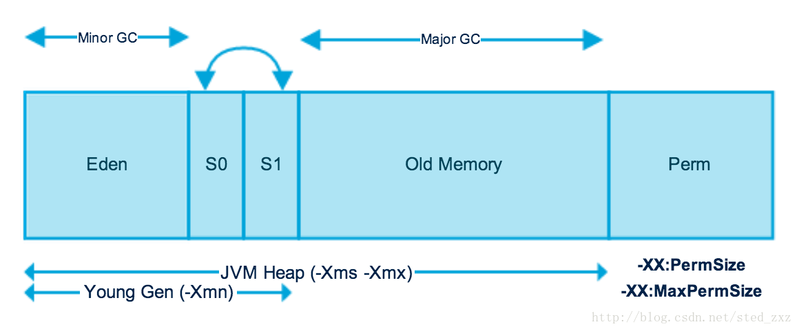
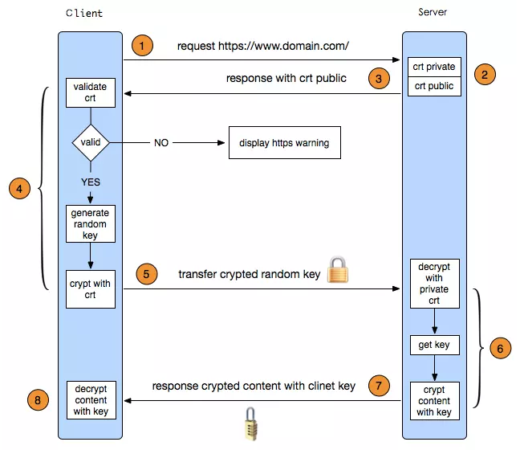

# Java Interview Questions

## Core

| Type |  Size   | Range |
|:----:|:-------:|:-----:|
| byte | 8 bits | -2^7 ~ 2^47 -1 |
| char | 16-bit unsigned | 0 ~ 2^16 -1 |
| int  | 32 bits | -2^31 ~ 2^31 -1 |
| long | 64 bits | -2^63 ~ 2^63 -1 |

What is protected access modifier?

* Variables, methods and constructors which are declared protected in a superclass can be accessed only by the subclasses in other package or any class within the package of the protected members' class.

Why is String class considered immutable?

* The String class is immutable, so that once it is created a String object cannot be changed. Since String is immutable it can safely be shared between many threads ,which is considered very important for multithreaded programming.

Exception

| Throwable |Throwable|Throwable|
| ----| ---- | --- |
| Exception |Exception| Error |
| Checked exceptions |Unchecked exceptions ||
| IOException | RuntimeException ||

What is Polymorphism?

* Polymorphism is the ability of an object to take on many forms. The most common use of polymorphism in OOP occurs when a parent class reference is used to refer to a child class object.

What is Abstraction?

* It refers to the ability to make a class abstract in OOP. It helps to reduce the complexity and also improves the maintainability of the system.

What is Encapsulation?

* It is the technique of making the fields in a class private and providing access to the fields via public methods. If a field is declared private, it cannot be accessed by anyone outside the class, thereby hiding the fields within the class. Therefore encapsulation is also referred to as data hiding.

Differences between final and immutability

* final means that you can’t change the object’s reference to point to another reference or another object, but you can still mutate its state (using setter methods e.g). Whereas immutable means that the object’s actual value can’t be changed, but you can change its reference to another one.
* final modifier is applicable for variable but not for objects, Whereas immutability applicable for an object but not for variables.
By declaring a reference variable as final, we won’t get any immutability nature, Even though reference variable is final. We can perform any type of change in the corresponding Object. But we cant perform reassignment for that variable.
* final ensures that the address of the object remains the same whereas the Immutable suggests that we can’t change the state of the object once created.

What is the benefit of Composition over Inheritance?

* Any change in the superclass might affect subclass even though we might not be using the superclass methods. For example, if we have a method test() in the subclass and suddenly somebody introduces a method test() in the superclass, we will get compilation errors in the subclass. The composition will never face this issue because we are using only what methods we need.
* Inheritance exposes all the superclass methods and variables to the client and if we have no control in designing superclass, it can lead to security holes. Composition allows us to provide restricted access to the methods and hence more secure.

Can a constructor be made final?

* No

Can constructor be inherited?

* No, constructor cannot be inherited.

What is the difference between inner class and nested class?

* When a class is defined within a scope of another class, then it becomes inner class. If the access modifier of the inner class is static, then it becomes nested class.

## JVM and GC

* Heap = Young Gen + Old Gen + Perm (64MB)
  * Free space < 40%, increase till `-Xmx`
  * Free space > 70%, decrease till `-Xms`
* Young Gen (`-Xmn`): Space to store newly created objects, it contains __Eden__, __S0__(Survivors from last GC), __S1__(inactive, S0 and S1 will swap next time)
* Minor GC: GC against Young Gen using _Copy and Collection_ since it needs to have consistent space to store new object. When it runs, the GC hangs the program and copy all active objects from __Eden__, __S0__(active) into __S1__(inactive). All objects survive from GC will have +1 age
* Old Gen: When the age of an object reaches `XX:MaxTenuringThreshold` (default 15), the object will be moved to _Old Generation_
* Major GC: against Old Gen using _Mark and Sweep GC_ (Traverse from the root and delete space if an object is not reachable). It is also called _Full GC_ since it runs against whole _heap_
* Perm Gen: Store Class and Meta info

Algorithms for GC

1. Reference Counting: pro: effective; con: cannot handle circulate referring.
2. Mark and Sweep: traverse from the root set, if an object cannot be accessible, _mark_ it as garbage, and release its space during _sweep_. Disadvantage: if there are small amounts of objects alive, it will cost large time to mark and delete them.
3. Copy and Collection: traverse from the root set, if an object is live, copy into into a space. Disadvantage: if there are large amounts of objects alive, copying them is expensive.

## Multi-thread

What is the key difference between a process and a thread?

* A process is an execution of a program but a thread is a single execution sequence within the process. A process can contain multiple threads.
* A JVM runs in a single process and each process will have its own heap. Threads run within a process (i.e. a JVM process), and share the heap belonging to that process. This is why several threads may access the same object. Threads share the same heap and have their own stack space. This is how one thread’s invocation of a method and its local variables are kept thread safe from other threads.

Explain different ways of creating a thread?

1. Extending the java.lang.Thread class.
2. Implementing the java.lang.Runnable interface.

Which approach would you favor and why?

Favor Callable interface with the Executor framework for thread pooling.

1. The thread pool is more efficient. Even though the threads are light-weighted than creating a process, creating them utilizes a lot of resources. Also, creating a new thread for each task will consume more stack memory as each thread will have its own stack and also the CPU will spend more time in context switching. Creating a lot many threads with no bounds to the maximum threshold can cause application to run out of heap memory. So, creating a Thread Pool is a better solution as a finite number of threads can be pooled and reused. The runnable or callable tasks will be placed in a queue, and the finite number of threads in the pool will take turns to process the tasks in the queue.
2. The Runnable or Callable interface is preferred over extending the Thread class, as it does not require your object to inherit a thread because when you need multiple inheritance, only interfaces can help you. Java class can extend only one class, but can implement many interfaces.
3. The Runnable interface’s void run() method has no way of returning any result back to the main thread. The executor framework introduced the Callable interface that returns a value from its call() method. This means the asynchronous task will be able to return a value once it is done executing.

How to end a Thread?

1. The thread ends when the run() method finishes its execution.
2. When the thread throws an Exception or Error that is not being caught in the program.
3. Java program completes or ends.
4. Another thread calls stop() methods.

Callable vs Runnable

__Note that a thread can't be created with a Callable__

1. For implementing Runnable, the `run()` method needs to be implemented which does not return anything, while for a Callable, the `call()` method needs to be implemented which returns a result on completion. Note that a thread can't be created with a Callable, it can only be created with a Runnable.
1. The `call()` method can throw an exception whereas `run()` cannot.

What is Future?

* To create the thread, a Runnable is required. To obtain the result, a Future is required.
* When the call() method completes, answer must be stored in an object known to the main thread, so that the main thread can know about the result that the thread returned. How will the program store and obtain this result later? For this, a Future object can be used. Think of a Future as an object that holds the result – it may not hold it right now, but it will do so in the future (once the Callable returns). Thus, a Future is basically one way the main thread can keep track of the progress and result from other threads. To implement this interface, 5 methods have to be overridden, but as the example below uses a concrete implementation from the library, only the important methods are listed here.
* Observe that Callable and Future do two different things – Callable is similar to Runnable, in that it encapsulates a task that is meant to run on another thread, whereas a Future is used to store a result obtained from a different thread. In fact, the Future can be made to work with Runnable as well, which is something that will become clear when Executors come into the picture.

What is the difference between yield and sleep? What is the difference between the methods `sleep()` and `wait()`?

* When a task invokes yield(), it changes from running state to runnable state
* When a task invokes sleep(), it changes from running state to waiting/sleeping state.

When shall we use `synchronization`?

1. Synchronization is the capability to control the access of multiple threads to shared resources. synchronized keyword in java provides locking which ensures mutual exclusive access of shared resource and prevent data race.
1. If we do not use synchronization and let two or more threads access a shared resource at the same time, it will lead to distorted results. Here is an example: Let’s assume that we have two different threads T1 and T2, T1 that start execution and save certain values in a file sample.txt which will be used to calculate some results when T1 returns. Meanwhile, T2 starts and before T1 returns, T2 changes the values saved by T1 in the file sample.txt (sample.txt is the shared resource). Now obviously T1 will give the wrong result.
1. Synchronization was introduced to prevent such problems from happening. If we use synchronization in the above-mentioned case, once T1 starts using sample.txt file, this file will be locked(LOCK mode), and no other thread will be able to access or modify it until T1 returns.

What is deadlock?

Deadlock describes a situation where two or more threads are blocked forever, waiting for each other. Deadlock occurs when multiple threads need the same locks but obtain them in a different order. A Java multi-threaded program may suffer from the deadlock condition because the synchronized keyword causes the executing thread to block while waiting for the lock, or monitor, associated with the specified object.
In order to avoid deadlock, one should ensure that when you acquire multiple locks, you always acquire the locks in the same order in all threads.

Deadlock Conditions

1. Mutual exclusion:
The resources involved must be unshareable.The resource is only used by current thread.
2. Hold and wait or partial allocation:
The processes must hold the resources they have already been allocated while waiting for other (requested) resources.
3. No pre-emption:
The processes must not have resources taken away while that resource is being used.
4. Resource waiting or circular wait:
A circular chain of processes exists: with each process holding resources which are currently being requested by the next process in the chain

Deadlock prevention works by preventing one of the four Coffman conditions from occurring.

* Removing the mutual exclusion condition means that no process will have exclusive access to a resource. This proves impossible for resources that cannot be spooled. But even with spooled resources, the deadlock could still occur. Algorithms that avoid mutual exclusion are called non-blocking synchronization algorithms.
* The hold and wait or resource holding conditions may be removed by requiring processes to request all the resources they will need before starting up (or before embarking upon a particular set of operations). This advance knowledge is frequently difficult to satisfy and, in any case, is an inefficient use of resources. Another way is to require processes to request resources only when it has none; First they must release all their currently held resources before requesting all the resources they will need from scratch. This too is often impractical. It is so because resources may be allocated and remain unused for long periods. Also, a process requiring a popular resource may have to wait indefinitely, as such a resource may always be allocated to some process, resulting in resource starvation.
* The no preemption condition may also be difficult or impossible to avoid as a process has to be able to have a resource for a certain amount of time, or the processing outcome may be inconsistent or thrashing may occur. However, the inability to enforce preemption may interfere with a priority algorithm. Preemption of a "locked out" resource generally implies a rollback, and is to be avoided since it is very costly in overhead. Algorithms that allow preemption include lock-free and wait-free algorithms and optimistic concurrency control. If a process holding some resources and requests for some another resource(s) that cannot be immediately allocated to it, the condition may be removed by releasing all the currently being held resources of that process.
* The final condition is the circular wait condition. Approaches that avoid circular waits include disabling interrupts during critical sections and using a hierarchy to determine a partial ordering of resources. If no obvious hierarchy exists, even the memory address of resources has been used to determine ordering and resources are requested in the increasing order of the enumeration. Dijkstra's solution can also be used.

What does re-entrant mean regarding intrinsic or explicit locks?

* Re-entrant means that locks are acquired on a per-thread rather than per-invocation basis. In Java, both intrinsic and explicit locks are re-entrant.

How does thread communicate with each other?

* Object class wait(), notify() and notifyAll() methods allows threads to communicate about the lock status of a resource

Why wait(), notify() and notifyAll() methods have to be called from synchronized method or block?

* When a Thread calls wait() on any Object, it must have the monitor on the Object that it will leave and goes in wait state until any other thread call notify() on this Object. Similarly when a thread calls notify() on any Object, it leaves the monitor on the Object and other waiting threads can get the monitor on the Object. Since all these methods require Thread to have the Object monitor, that can be achieved only by synchronization, they need to be called from synchronized method or block.

What is volatile keyword in Java

* When we use volatile keyword with a variable, all the threads read it’s value directly from the memory instead of temporary registers. This makes sure that the value read is the same as in the memory.

Which is more preferred – Synchronized method or Synchronized block?

* Synchronized block is more preferred way because it doesn't lock the Object, synchronized methods lock the Object and if there are multiple synchronization blocks in the class, even though they are not related, it will stop them from execution and put them in wait state to get the lock on Object.

## Server

REST vs SOAP

1. SOAP is a protocol whereas REST is architecture. REST is protocol independent. It's not coupled to HTTP
1. SOAP exposes behavior which represent logic whereas REST exposes resources
1. SOAP supports both POST and GET methods. However, GET includes the request in the query string. SOAP requests (XML messages) are usually too complex and verbose to be included in the query string, so almost every implementation (for example JAX-WS) supports only POST
1. . SOAP can use almost any transport to send the request but REST uses HTTP/HTTPS
1. Any SOAP envelope can be used in REST services like generated token but not vice versa. This means that if you have created a token using SOAP then that token can be used in REST (under HTTP header manager section => Authorization). But you can not use REST envelopes in a SOAP request.
1. SOAP provides good security option. Although SOAP and REST both support SSL (Secure Socket Layer) for data protection, while making the request, SOAP supports Web Services Security for enterprise-level protection which offers protection from the creation of the message to it's consumption. Security and authentication in HTTP are standardized, so that's what you use when doing REST over HTTP
1. REST is Faster. The statelessness nature of REST makes it faster than a SOAP.
1. SOAP only support XML, but REST supports different format like text, JSON, XML

REST Principles

* Stateless: Each client request to the server requires that its state be fully represented. The server must be able to completely understand the client request without using any server context or server session state. It follows that all state must be kept on the client
* Cacheable: Cache constraints may be used, thus enabling response data to be marked as cacheable or not-cacheable. Any data marked as cacheable may be reused as the response to the same subsequent request.
* Uniform Interface: All components must interact through a single uniform interface

What is payload?

When data is sent over the Internet, each unit transmitted includes both header information and the actual data being sent. The header identifies the source and destination of the packet, __while the actual data is referred to as the payload__. In general, the payload is the data that is carried on behalf of an application and the data received by the destination system.

HTTP vs HTTPS

1. HTTP is also called "a stateless system", which means that it enables connection on demand
1. HTTP can be intercepted and potentially altered. Any data you enter into the site will be sent __plaintext__ and therefore susceptible to interception or eavesdropping
1. HTTPS is secured by Transport Layer Security (TLS)
1. SSL/TLS provides a secure channel between two machines or devices operating over the internet or an internal network

HTTPS handshake

* Public key: used for encrypt the plain text to convert it into cipher text. Having a public key we can verify a message is created by someone with private key (verify the source)
* Private key: used by receiver to decrypt the cipher text to read the message.
* Certificate = Website info + Signature. An SSL certificate is used to authenticate the identify of a website
* Signature = encrypt(hash(all details))
* Certificate Authority: A known CA can sign web server requests so that anyone with the CA's public key can verify that requests were signed it by the CA. Browsers have these known CA's public key embedded and verify the information from the Certificate is trustable. This is to avoid Man in the mid attack and we can find it out the website we are talking is not youtube.com

1. Client sends `HTTP` request to the server's port 443, including TLS version, Key(RSA), supported Cipher (AES), Hash(HMAC-MD5)
2. Server responses with TLS version, random2, confirmed encryption method (RSA), and Certificate and public key
3. After the client gets the Certificate, client will check who is the root CA. client will decrypt signature using third-party public key, and then calculated the public key from the signature, lastly compare the calculated public key from response.
4. After the client authorizes the certificate, client generate __Pre-Master Key__ encrypted by the public key and sends to the server
5. The server gets the __Pre-Master Key__  by decrypting the private key. Therefore both client and server have the same random1, random2, pre-master key. Then both of them calculate the session-key and mac-key based on it (Symmetric Key).
6. All following messages will be encrypted by this new key

Status codes

* 201 Created

The request has succeeded and a new resource has been created as a result. This is typically the response sent after POST requests, or some PUT requests.

* 202 Accepted

The request has been received but not yet acted upon. It is noncommittal, since there is no way in HTTP to later send an asynchronous response indicating the outcome of the request. It is intended for cases where another process or server handles the request, or for batch processing.

* 204 No Content

There is no content to send for this request, but the headers may be useful. The user-agent may update its cached headers for this resource with the new ones.

* Redirects (300–399)

* 400 Bad Request

The server could not understand the request due to invalid syntax.

* 401 Unauthorized
* 403 Forbidden
* 408 Request Timeout

## Spring

What do you understand by Dependency Injection?

Dependency Injection design pattern allows us to remove the hard-coded dependencies and make our application loosely coupled, extendable and maintainable. We can implement dependency injection pattern to move the dependency resolution from compile-time to runtime.

What do you understand by Aspect Oriented Programming?

* Enterprise applications have some common cross-cutting concerns that are applicable to different types of Objects and application modules, such as logging, transaction management, data validation, authentication etc. In Object Oriented Programming, modularity of application is achieved by Classes whereas in AOP application modularity is achieved by Aspects and they are configured to cut across different classes methods.
* AOP takes out the direct dependency of cross-cutting tasks from classes that are not possible in normal object-oriented programming. For example, we can have a separate class for logging but again the classes will have to call these methods for logging the data.

What is Spring IoC Container?

Inversion of Control (IoC) is the mechanism to achieve loose-coupling between Objects dependencies. To achieve loose coupling and dynamic binding of the objects at runtime, the objects define their dependencies that are being injected by other assembler objects. Spring IoC container is the program that injects dependencies into an object and makes it ready for our use.

What are different scopes of Spring Bean?
There are five scopes defined for Spring Beans.

* Singleton: only one instance of the bean will be created for each container. This is the default scope for the spring beans
* Prototype: a new instance will be created every time the bean is requested.
* Request: this is same as prototype scope, however it’s meant to be used for web applications. A new instance of the bean will be created for each HTTP request.
* Session: a new bean will be created for each HTTP session by the container.
* Global-session: this is used to create global session beans for Portlet applications

## Linux commands

* free: get memory usage
* uname: get current user
* pushd and popd: save current directory into memory (like a stack) and return back
* locate: quick find files, need to `updatedb` first
* find /etc/ -name *.conf
* df: disk free, get space
* du: disk usage per directory level
* vmstat: get summary info of os in near-real time
* ps aux: process status
* ifconfig: get IP address
* netstat: list all connection
* wget: download a file
* telnet: like ssh, to access remote computers 

## Relational Database

What are all the different normalizations?

* First Normal Form (1NF):
This should remove all the duplicate columns from the table. Creation of tables for the related data and identification of unique columns.

* Second Normal Form (2NF):
Meeting all requirements of 1NF. Single column primary key (no composite key)

* Third Normal Form (3NF):
This should meet all requirements of 2NF. Removing the columns which are not dependent on primary key constraints.

* Fourth Normal Form (4NF):
Meeting all the requirements of third normal form and it should not have multi- valued dependencies.

What is the difference between DELETE, TRUNCATE and DROP commands?

* DELETE command is used to remove rows from the table, and WHERE clause can be used for conditional set of parameters. Commit and Rollback can be performed after delete statement.

* TRUNCATE removes all rows from the table. Truncate operation cannot be rolled back.

* DROP command removes a table from the database and operation cannot be rolled back.

What is a relationship?

Database Relationship is defined as the connection between the tables in a database.

* One to One
* One to Many
* Many to One
* Self-Referencing
* (Many to Many should be converted to 2 Many to One tables and use a bridge table connecting them)

What are clustered and non-clustered Indexes?

* Clustered indexes is the index according to which data is physically stored on disk. Therefore, only one clustered index can be created on a given database table.

* Non-clustered indexes don’t define physical ordering of data, but logical ordering. Typically, a tree is created whose leaf point to disk records. B-Tree or B+ tree are used for this purpos

What is the difference between primary key and unique constraints?

* Primary key cannot have NULL value, the unique constraints can have NULL values. There is only one primary key in a table, but there can be multiple unique constrains.