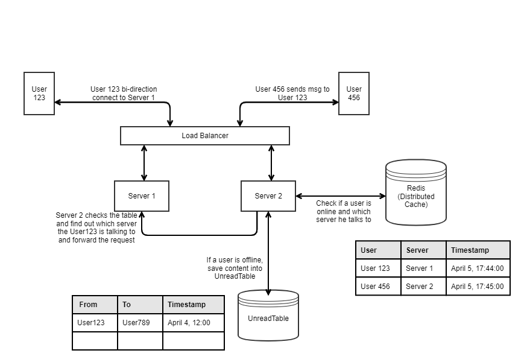

# Facebook Messenger

## Scenario

* Send one-to-one message
* Check user is online
* Check the messenger is read
* Send picture or file
* Security
* Content is not stored on the server

## Service

WebSocket: provides full-duplex communication channels over a single TCP connection

## Storage

* ActiveUserTable (in memory)

We have a Redis database to store __ACTIVE__ users and their associated server nodes

| User | Server | Timestamp |
| :----: | :----: | :----: |
| User123 | Server 1 | t1 |
| User456 | Server 2 | t2 |

* UserTable

| User A | User B | ConversationID | EncryptionID |
| :----: | :----: | :----: | :----: |
| User123 | User456 | con_01 | A1b2C3 |
| User123 | User789 | con_02 | abc456 |

* ConversationTable

| ConversationID | Timestamp | From | Text | URL |
| :---: | :---: | :---: | :---: | :---: |
| con_01 | t1 | User123 | Hello! | null |
| con_01 | t2 | User456 | World! | null |
| con_02 | t3 | User456 | Are you online? | null |
| con_03 | t4 | User123 | null | url1 (Pointing to a pic or video) |

* UnreadTable

| From | To | Timestamp | Read|
| :----: | :----: | :----: | :---: |
| User123 | User789 | t3 | False |

* Block file system

For picture or file, save it into a block file system rather than the __ConversationTable__ to optimize the speed

## Follow up

* Allow group chat
* Save the content on the server
